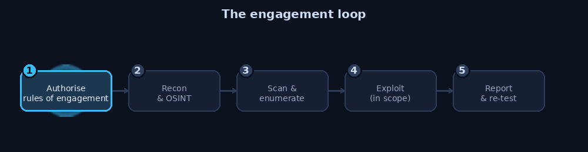

# Ethical Hacking Cheatsheet

A lightweight, practical reference for ethical hacking and defensive security.
Not a course and not a wall of theory: short, scannable sheets you keep open in
a second window while you work in a lab, each pairing the offensive technique
with the defence that stops it.

The organising idea of this repository: **you cannot defend what you do not
understand, and you have not understood an attack until you can both perform it
in a lab and describe how to shut it down.** Every sheet is written that way.

## Read this first

Everything here is for **authorised testing and education only**: your own
systems, a deliberately vulnerable lab you built, or an engagement you have
**written permission** to test.

Running these techniques against systems you do not own or are not contracted
to test is illegal in most countries, including under computer misuse and
unauthorised access laws, regardless of intent. There is no "I was just
learning" exception once the target is someone else's. Build a lab. Use the
lab. See [Legal and scope](sheets/00-legal-and-scope.md) before anything else.

## The engagement flow

A penetration test is not random poking. It follows a repeatable loop, and
every sheet in this repository maps onto one of these phases.

  

The two green boxes are where the value is. A finding nobody can reproduce and
nobody fixes was a waste of everyone's time.

## How the sheets are organised

| Sheet | Topic |
| --- | --- |
| [00. Legal and scope](sheets/00-legal-and-scope.md) | Authorisation, rules of engagement, staying lawful |
| [01. Build a lab](lab/README.md) | An isolated, safe environment to practise in |
| [02. Linux and terminal](sheets/02-linux-terminal.md) | The commands you actually need |
| [03. Anonymity and OPSEC](sheets/03-anonymity-opsec.md) | Tor, VPNs, MAC changing, and their real limits |
| [04. Reconnaissance and OSINT](sheets/04-recon-osint.md) | Footprinting, Google dorking, Maltego, SpiderFoot |
| [05. Scanning and enumeration](sheets/05-scanning-enumeration.md) | Nmap, Masscan, service and version discovery |
| [06. Network attacks and defence](sheets/06-network-attacks.md) | ARP spoofing, MITM, traffic analysis, and hardening |
| [07. Wireless](sheets/07-wireless.md) | WEP through WPA3, and how to secure a network |
| [08. Web application testing](sheets/08-web-apps.md) | Injection, XSS, traversal, file upload, and fixes |
| [09. Social engineering](sheets/09-social-engineering.md) | Phishing, spoofing, and the human defences |
| [10. Post-exploitation basics](sheets/10-post-exploitation.md) | What access means, and detection |
| [11. Toolbox reference](sheets/11-toolbox.md) | 40+ tools, what each is for, in one table |
| [12. Defensive checklist](sheets/12-defensive-checklist.md) | The blue-team summary of the whole repo |

## Who this is for

People learning offensive security in order to defend better: aspiring
penetration testers, blue teams who want to understand what they are up
against, and students building the practical, hands-on side to go with theory.

No prior knowledge is assumed. The lab guide starts from nothing.

## What this is not

Not a source of exploits against real targets, not a guide to evading law
enforcement, and not a substitute for a structured course or a professional
certification. It is a memory aid for people who already understand that
security testing is something you do with permission, in scope, and with a
report at the end.

## Licence

MIT. See [LICENSE](LICENSE). Use it lawfully.
