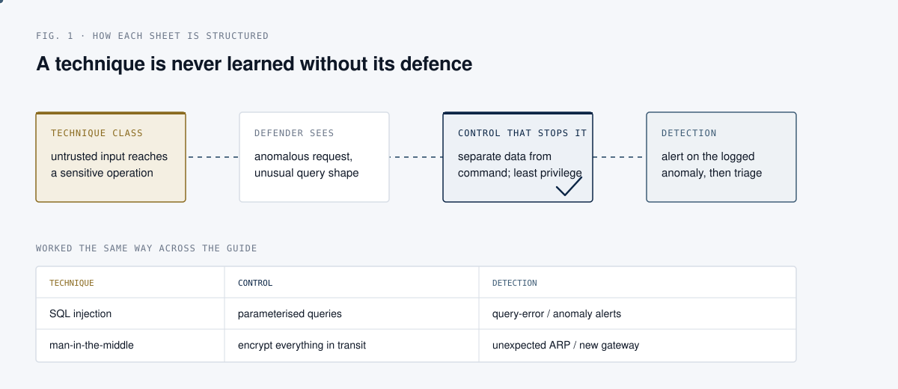
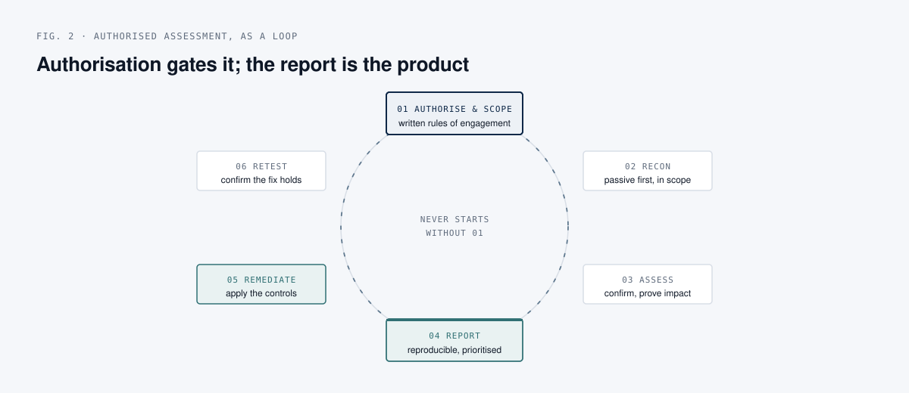

  

# Attack and Defence Field Guide

A defensive security field guide, written as paired sheets: each offensive
technique is set beside the control that stops it and the signal that detects
it. It is a memory aid for people learning to defend, not a toolkit for
attacking anyone. Short, scannable, and defence-first.

The organising idea: **you have not understood an attack until you can describe
the control that shuts it down and the log line that catches it.** Every sheet
is written that way, and the last sheet gathers all the defences into one
checklist.

## Read this first

Everything here is for **authorised testing and education only**: systems you
own, a deliberately vulnerable lab you built, or an engagement you have
**written permission** to test.

Unauthorised access to a computer system is a criminal offence in most
jurisdictions, and intent to learn is not a defence. This guide deliberately
stays at the level of concepts, controls, and detection. It does not provide
step-by-step exploitation instructions, payloads, or evasion recipes, and it is
not a substitute for a structured course. Build a lab, use the lab, and read
[Legal and scope](sheets/00-legal-and-scope.md) before anything else.

## Why it matters

Defenders lose most often not to novel attacks but to well-understood ones with
no control in place and nothing watching. A blue team that can name the attack,
the control, and the detection for each class of technique can reason about its
own gaps instead of chasing tools. This guide is built to make that pairing the
default way you think about a technique.

## How each sheet is structured

Every technique is read across the same four columns.

  

The control column is the point of the exercise. A technique you can describe
but cannot stop or see is an open gap, not knowledge.

## The authorised engagement loop

A professional assessment is not random poking. It is a loop, and it never
starts without written authorisation.

  

The two green boxes, report and remediate, are where the value is. A finding
nobody can reproduce and nobody fixes was a waste of everyone's time.

## The sheets

| Sheet | Topic |
| --- | --- |
| [00. Legal and scope](sheets/00-legal-and-scope.md) | Authorisation, rules of engagement, staying lawful |
| [01. Build a lab](lab/README.md) | An isolated, safe environment to practise in |
| [02. Linux and terminal](sheets/02-linux-terminal.md) | The command-line fluency everything else assumes |
| [03. Anonymity and OPSEC](sheets/03-anonymity-opsec.md) | What privacy tools do, and their real limits |
| [04. Reconnaissance and OSINT](sheets/04-recon-osint.md) | Footprinting and how to reduce your own exposure |
| [05. Scanning and enumeration](sheets/05-scanning-enumeration.md) | Service discovery, and exposing the minimum |
| [06. Network attacks and defence](sheets/06-network-attacks.md) | Man-in-the-middle, and why encryption is the answer |
| [07. Wireless](sheets/07-wireless.md) | WEP through WPA3, and how to secure a network |
| [08. Web application testing](sheets/08-web-apps.md) | Injection, XSS, traversal, upload, and their fixes |
| [09. Social engineering](sheets/09-social-engineering.md) | Phishing, spoofing, and the human and email defences |
| [10. Post-exploitation, defensively](sheets/10-post-exploitation.md) | What a foothold means, and why detection matters |
| [11. Toolbox reference](sheets/11-toolbox.md) | What each tool answers, in one table |
| [12. Defensive checklist](sheets/12-defensive-checklist.md) | The blue-team summary of the whole guide |

## Who this is for

People learning security in order to defend better: blue teams who want to
understand what they are up against, aspiring testers who already accept that
testing happens with permission and a report at the end, and students building
the practical side to go with theory. No prior knowledge is assumed; the lab
guide starts from nothing.

## Method

Each sheet describes a class of technique at a conceptual level, states what a
defender would observe, gives the control that stops it, and names the signal
that detects it. Tool usage is limited to safe, standard operation against your
own lab (for example, service discovery with a scanner against a host you own),
described at the level of what the tool answers rather than as an attack recipe.
The guide favours the defensive half everywhere, and collects it in sheet 12.

## Limitations and assumptions

- This is education, not a certification or a substitute for one, and not legal
  advice. Law varies by country and changes; verify before you act.
- It is deliberately concept-level. It does not include exploitation steps,
  payloads, credential-cracking walkthroughs, or evasion guidance.
- Controls and detections are described in general terms. Your environment
  decides the exact configuration, and the guide points at the idea, not a
  copy-paste fix.
- Tool names age. Treat the toolbox as a map of categories, and check current
  documentation for anything you actually run.

## Sources

Written from public, widely documented security concepts and the author's own
synthesis. Legal references (computer-misuse and unauthorised-access laws) are
named in [Legal and scope](sheets/00-legal-and-scope.md); email-authentication
standards (SPF, DKIM, DMARC) and the wireless and web-security concepts referred
to are all publicly specified. No non-public material is used.

## Licence

MIT. See [LICENSE](LICENSE). Use it lawfully.
