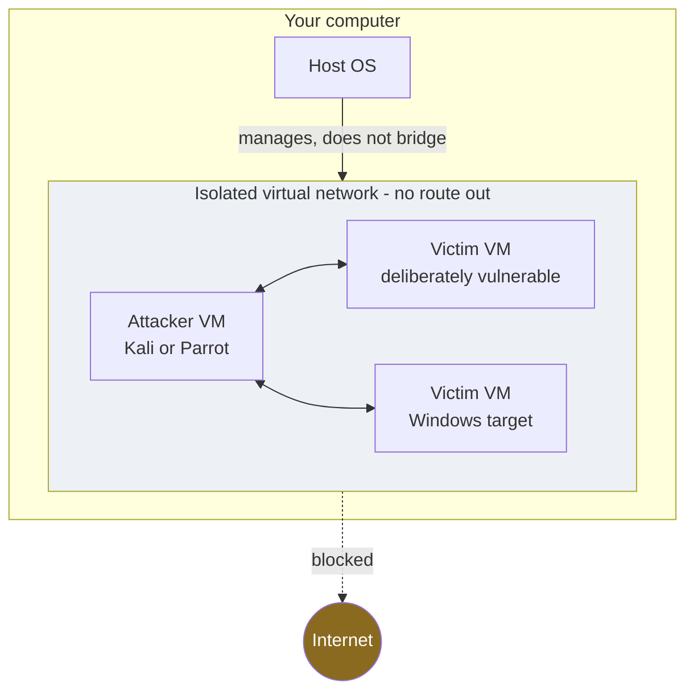

# Build a lab

You need a place to practise where mistakes are free and legal. This is that
place: an isolated network of virtual machines that cannot reach anything real.

## The principle: isolation

Your lab must not be able to touch the internet or your home network while you
attack inside it. One misconfigured interface is the difference between a
training exercise and a crime. Use a **host-only** or **internal** virtual
network so the lab machines can talk to each other and to nothing else.

The red node is what must never be reachable from inside the lab.

## Minimum kit

| Piece | Purpose | Note |
| --- | --- | --- |
| A hypervisor | Runs the virtual machines | VirtualBox is free; VMware and others work too |
| Attacker VM | Where your tools live | Kali Linux or Parrot OS, both purpose-built |
| Vulnerable target(s) | What you practise on | Intentionally weak training images exist for exactly this |
| A Windows target | Realistic enumeration practice | An evaluation image is fine |
| Snapshots | Undo button | Snapshot a clean state so you can reset in seconds |

## Setup order

1. Install the hypervisor.
2. Create an **internal / host-only** network. Confirm it has no NAT or bridge
   to your real network.
3. Import the attacker VM. Update its tools once (this one step may need
   internet; do it, then move the VM onto the isolated network).
4. Import the target VMs onto the same isolated network.
5. From the attacker VM, confirm you can reach a target and **cannot** reach
   the internet. If you can reach the internet, stop and fix the network before
   going further.
6. Snapshot everything in a clean state.

## Portable option

A bootable USB running a live security distribution gives you a throwaway
environment on any machine. Useful for learning the tools; still bound by the
same rule that you only test systems you are authorised to test. A portable
toolkit does not portably grant permission.

## Good lab habits

- **Snapshot before each session**, roll back after. You learn faster when
  breaking things has no cost.
- **Keep a logbook.** What you tried, what worked, what the defence was. This
  becomes your personal cheatsheet and, later, the muscle memory for a report.
- **Rebuild occasionally from scratch.** Setting the lab up again is itself
  one of the most useful things you will practise.
