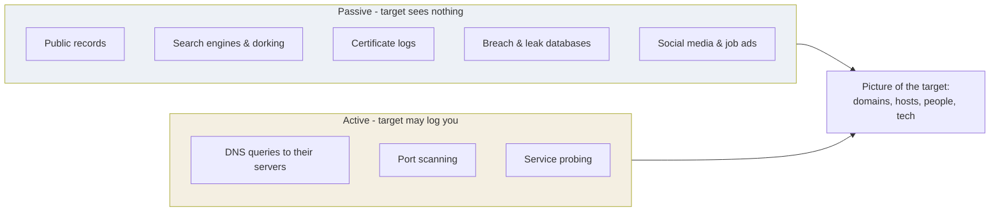

# Reconnaissance and OSINT

Reconnaissance is building a picture of the target before you touch it. Done
well, most of a test's useful information comes from here, and much of it never
sends a single packet to the target's own systems.

## Passive versus active

**Do passive first.** Exhaust what you can learn without alerting anyone, then
move to active only within scope. The ordering is both good tradecraft and,
often, a rule of engagement.

## Footprinting checklist

The categories worth building out for any target:

| Category | What you are looking for |
| --- | --- |
| Domains & subdomains | The full attack surface, not just the main site |
| IP ranges | What the organisation actually owns |
| DNS records | Mail servers, subdomains, misconfigurations |
| Certificates | Subdomains leak in certificate transparency logs |
| Technologies | Frameworks, servers, versions, third-party services |
| People | Names, roles, email format, for later phishing awareness testing |
| Exposed data | Documents, credentials in code repositories, misconfigured storage |

## Google dorking

Search operators that surface things that should not be public. Educational use
is to find your *own* organisation's exposures before an attacker does.

| Operator | Finds |
| --- | --- |
| `site:` | Pages on one domain only |
| `filetype:` | Specific file types (documents, backups, configs) |
| `intitle:` / `inurl:` | Keywords in the page title or URL |
| `-` | Excludes a term to cut noise |
| `cache:` | A search engine's stored copy of a page |

The defensive lesson: anything reachable by a crawler is reachable by everyone.
Keep sensitive files off web roots, and audit what search engines have indexed
about you.

## OSINT tooling, conceptually

- **Link-analysis tools** map relationships between people, domains, emails and
  infrastructure into a graph, so you see connections a list would hide.
- **Automated OSINT frameworks** pull from many public sources at once and
  correlate the results, turning hours of manual searching into one run.
- **Certificate transparency search** enumerates subdomains from public logs
  that every issued certificate is recorded in.
- **Breach-lookup services** tell you whether an address appears in known public
  data leaks, which is a defensive signal (rotate those credentials) far more
  than an offensive one.

## The defence

- Publish only what you must. Job adverts revealing your exact technology stack,
  documents with revealing metadata, and forgotten subdomains are the classic
  leaks.
- Monitor certificate transparency for certificates issued on your domains.
- Search for your own organisation the way an attacker would, on a schedule.
- Assume email address format is public (it is), and defend the login, not the
  username.
