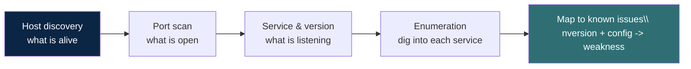

# Scanning and enumeration

Once you know what exists, scanning tells you what is listening and enumeration
tells you what it is. This is active: the target can see and log you, so it must
be in scope.

## The flow

Each arrow narrows the surface. You start with a range and end with a short list
of specific services worth a closer look.

## Port states, in plain terms

A scanner reports each port as one of a few states, and the meaning matters:

| State | Meaning |
| --- | --- |
| open | Something is listening and accepting connections |
| closed | Reachable, but nothing is listening |
| filtered | A firewall is dropping the probe; you cannot tell |

"Filtered" everywhere usually means a firewall is doing its job, which is a
finding in itself.

## Nmap, the core commands

Nmap is the standard tool. The patterns you reach for constantly, to run against
**your own lab**:

| Goal | Command shape |
| --- | --- |
| Quick host discovery | `nmap -sn <range>` (ping sweep, no port scan) |
| Default scan | `nmap <host>` (top common ports) |
| All ports | `nmap -p- <host>` |
| Service and version | `nmap -sV <host>` |
| OS guess | `nmap -O <host>` |
| Scripted checks | `nmap -sC <host>` (default safe scripts) |
| The common combination | `nmap -sV -sC -p- <host>` |
| Faster, noisier | add `-T4`; slower, quieter, use a lower `-T` |

A slower scan is stealthier and kinder to fragile targets. Speed is a knob, not
a default.

## Masscan for scale

Where Nmap is thorough, Masscan is fast: it is built to sweep huge ranges for a
few ports quickly, then you hand the interesting hosts to Nmap for detail. The
pairing (broad and fast, then narrow and deep) is the standard approach at
scale.

## Enumeration is where the work is

An open port is a question, not an answer. Enumeration answers it:

- **Web (80/443):** what application, what framework, what version, what
  directories and endpoints exist. See [web apps](08-web-apps.md).
- **File shares:** what is shared, and whether it allows anonymous access.
- **Mail, databases, remote access:** what version, what authentication, what
  is exposed that should not be.

The pattern is always the same: identify the service, identify its version,
identify its configuration, and compare against known weaknesses for that exact
version.

## IPv6, the surface people forget

Many networks are hardened on IPv4 and left wide open on IPv6, because the
defenders forgot it was enabled. If the lab supports it, enumerate IPv6
alongside IPv4. The defensive lesson is direct: **secure both stacks or disable
the one you are not using.** An unmonitored protocol is an unlocked back door.

## The defence

- Expose the minimum. Every open port is attack surface that must be justified.
- Patch by version. Most of what enumeration finds is "old version with a known
  problem".
- Watch for scans. A sudden sweep of your ports is an early warning, and it is
  detectable.
- Treat IPv6 as a first-class citizen in your firewall rules, not an
  afterthought.
