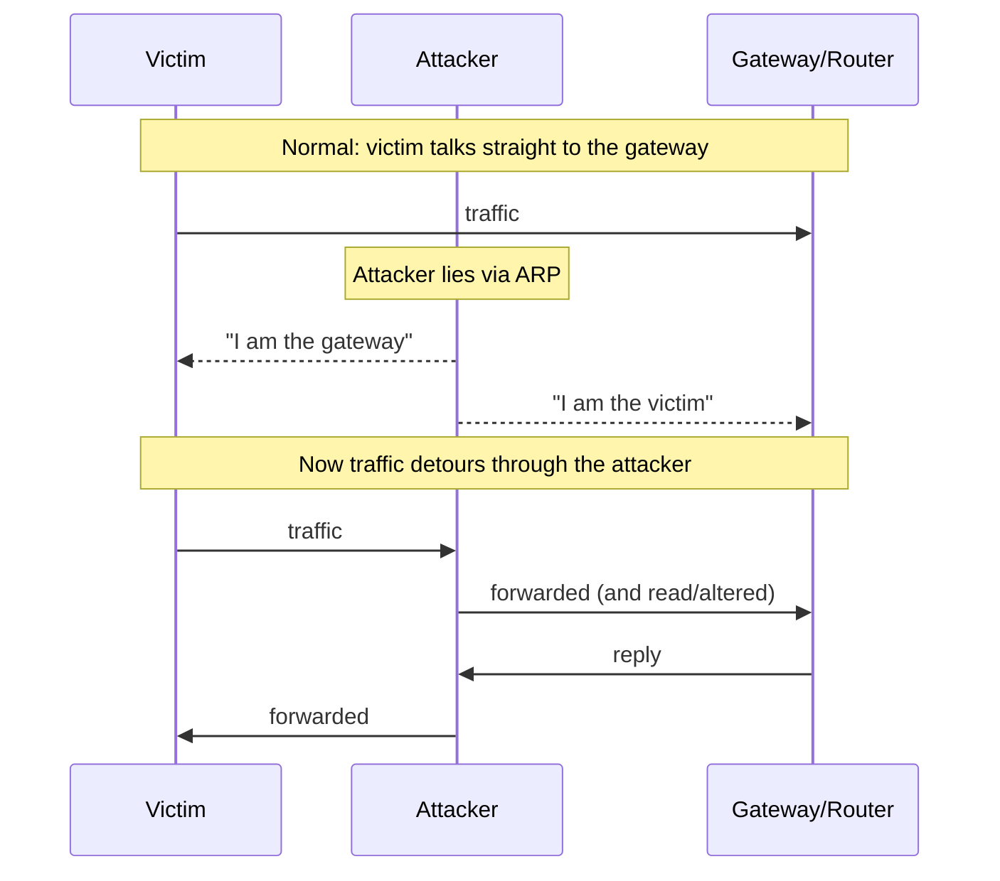

# Network attacks and defence

On a local network, an attacker who can position themselves between two parties
can read and alter traffic. Understanding this is the foundation of both the
attack and the defence.

## Man-in-the-middle via ARP spoofing

On a typical local network, machines find each other using ARP, a protocol with
no authentication. That gap is the whole attack.

Because ARP has no way to verify a claim, the victim believes the attacker is
the gateway and sends its traffic there. The attacker forwards it on, so nothing
looks broken, while reading everything in between.

## What this exposes

Once in the middle, an attacker can:

- Read anything sent **unencrypted** (this is why plain HTTP, old mail
  protocols, and unencrypted DNS are dangerous on shared networks).
- Analyse traffic patterns even when content is encrypted.
- Attempt to tamper with unauthenticated traffic.

The critical point: **encryption is the defence that survives a
man-in-the-middle.** Properly validated HTTPS traffic passing through an
attacker remains unreadable. The attack is old; the reason it still matters is
that plaintext still exists.

## Traffic analysis

A packet analyser reconstructs conversations from captured traffic. Defensively,
it is how you understand your own network and spot anomalies. It reveals, from
unencrypted traffic, exactly the sensitive data (credentials, session cookies,
messages) that encryption is meant to protect, which is the most persuasive
argument for encrypting everything that exists.

## Other local-network techniques (concept and defence)

| Technique | Idea | Defence |
| --- | --- | --- |
| DHCP starvation/flooding | Exhaust the pool of addresses a network can hand out | Rate limiting and port security on switches |
| Rogue services | Stand up a fake service to capture connections | Authentication and network monitoring |
| DNS spoofing | Answer name lookups with attacker-chosen addresses | Encrypted, authenticated DNS |

These are lab exercises. Running them on a network you do not own is both
harmful and illegal.

## The defence, gathered

- **Encrypt everything in transit.** It is the single control that defeats a
  man-in-the-middle regardless of position.
- **Segment the network.** An attacker who compromises one segment should not
  see the whole organisation.
- **Harden switches:** port security, and features that inspect and limit ARP
  and DHCP where available.
- **Monitor.** Sudden ARP changes and unexpected services are detectable
  signals of exactly these techniques.
- **Distrust the local network by default.** Modern security architectures
  assume the internal network is already hostile, and protect each service
  accordingly.
