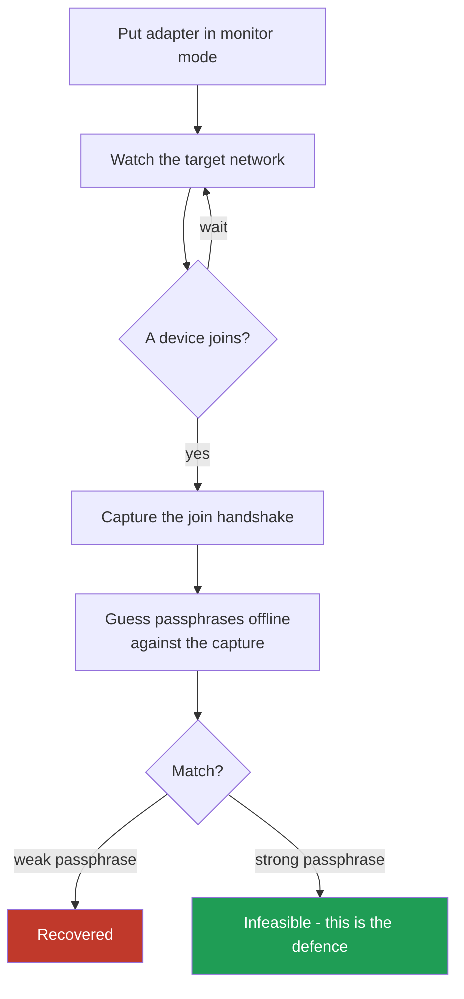

# Wireless

Wi-Fi security is a story of encryption standards, each fixing the last one's
flaws. Knowing which standard a network uses tells you almost everything about
how exposed it is.

## The standards, worst to best

| Standard | Status | One-line verdict |
| --- | --- | --- |
| WEP | Broken | Trivially crackable; never acceptable |
| WPA | Weak | Superseded; avoid |
| WPA2 | Standard | Solid if the passphrase is strong; vulnerable to offline guessing of weak passphrases |
| WPA3 | Current | Fixes WPA2's offline-guessing weakness; use where supported |

The headline: **the encryption is usually not the weak point on WPA2. The
passphrase is.** A strong, long, random passphrase on WPA2 resists the standard
attack. A short or common one does not.

## How the WPA2 passphrase attack works, at a concept level

You do not break the encryption. You capture the brief exchange that happens
when a device joins, then guess the passphrase offline against that capture.

Two things make the difference between the red outcome and the green one:

- **Passphrase strength.** Offline guessing only works if the guess space is
  small enough. Length and randomness make it infeasible. This is the entire
  defence.
- **WPA3** changes the handshake so that this offline-guessing approach does not
  work in the same way, which is why it is the recommended standard.

## Capturing the handshake

You need a wireless adapter that supports **monitor mode** (listening to all
traffic, not just your own). Waiting for a device to join produces the
handshake naturally; the capture itself is passive listening.

## Rogue access points

An attacker can stand up a fake network with the same name as a trusted one, so
devices connect to it by mistake, putting the attacker in the middle (see
[network attacks](06-network-attacks.md)). The defence for users is to distrust
open networks and rely on encryption at the application layer; the defence for
operators is monitoring for unexpected access points broadcasting your name.

## The defence, gathered

- **Use WPA3** where every device supports it; otherwise WPA2 with a **long,
  random passphrase** (a passphrase, not a word).
- Never run WEP or WPA. If a device only supports those, it is the problem.
- Change default router credentials and keep firmware current.
- Separate guest Wi-Fi from the internal network entirely.
- For sensitive environments, use enterprise authentication (per-user
  credentials, not one shared passphrase) so a leaked key does not open
  everything.
- Assume Wi-Fi is hostile and secure the services on top of it regardless.
