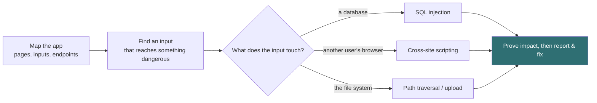
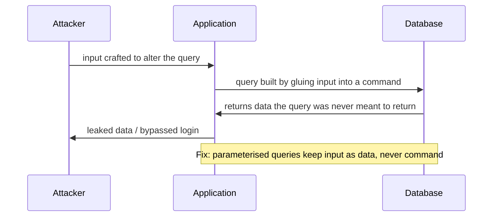

# Web application testing

Most real-world compromise happens through web applications, because they are
exposed by design and complex enough to hide mistakes. These are the classics
and, more importantly, how to stop them.

## The shape of a web attack

The common thread across all of them: **untrusted input reaching a sensitive
operation without being properly handled.** Every fix is a version of "do not
trust input, and separate data from commands".

## SQL injection

Untrusted input is concatenated into a database query, so the input can change
what the query does, bypassing logins or reading data it should not.

**The fix is settled and total:** use parameterised queries (also called
prepared statements), so user input is always treated as data and can never
become part of the command. Input validation and least-privilege database
accounts are defence in depth on top of that.

## Cross-site scripting (XSS)

The application reflects untrusted input back into a page without neutralising
it, so an attacker's script runs in another user's browser: stealing session
cookies, acting as that user, or altering the page.

| Type | How it reaches the victim |
| --- | --- |
| Reflected | Delivered in a crafted link the victim clicks |
| Stored | Saved by the app (a comment, a profile) and served to everyone who views it |

**The fix:** encode output for the context it lands in, validate input, and use
protections like a content security policy and cookie flags that keep session
cookies out of reach of scripts. Stored XSS is the more dangerous because one
injection hits every viewer.

## Path traversal

Input meant to name a file is manipulated to escape the intended directory and
reach files elsewhere on the server. **The fix:** never build file paths from
raw user input; validate against an allowlist and resolve the final path to
confirm it stays inside the permitted directory.

## File upload flaws

An upload feature that does not properly restrict what it accepts can let an
attacker place an executable file on the server. **The fix:** validate the
actual file type, store uploads outside the web root, never execute them, and
rename them so the attacker does not control the path.

## Command injection

Like SQL injection but the input reaches an operating-system command. Same
principle, same class of fix: never build commands from untrusted input; use
safe APIs that separate the command from its arguments.

## The tools

Interception proxies sit between your browser and the application so you can see
and modify every request, which is how almost all manual web testing is done.
Automated scanners probe for these issues at scale. Both are for applications
you own or are authorised to test.

## The defence, gathered

The whole sheet reduces to a short list:

- **Separate data from commands** everywhere: parameterised queries, safe APIs.
- **Encode output** for its context; **validate input** on the way in.
- **Never trust a file path or a file** that came from a user.
- **Least privilege**: the app's database account and file permissions should
  be as narrow as the app can tolerate.
- **Defence in depth**: content security policy, secure cookie flags, a web
  application firewall as a backstop, and keeping every component patched.
