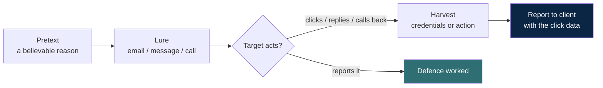

# Social engineering

The most reliable way past technical defences is often the person using them.
Social engineering tests whether an organisation's people can be manipulated,
and it is only ever conducted with explicit authorisation, because it targets
humans.

## Why it works

It exploits normal, useful human tendencies: to trust, to help, to obey
authority, to act under urgency, and to avoid conflict. The defence is not to
make people cynical; it is to build habits and processes that do not depend on
any single person's judgement in a pressured moment.

## The phishing flow

In an authorised test, both green and blue are wins: a reported lure proves the
training works, and click data shows where it does not. The goal is a metric and
a lesson, never to embarrass an individual.

## Common pretexts (for awareness)

| Pretext | The hook it uses |
| --- | --- |
| Account problem | Fear and urgency ("your account will be closed") |
| Authority request | Obedience ("the director needs this now") |
| Helpful IT | Trust ("we are fixing your mailbox") |
| Delivery/invoice | Routine ("your parcel", "overdue invoice") |

## Email spoofing, at a concept level

Email was designed without built-in sender verification, so the visible "from"
address can be forged. The defences are technical standards that let a receiving
server check whether a message genuinely came from the domain it claims:

| Control | What it does |
| --- | --- |
| SPF | Declares which servers may send mail for a domain |
| DKIM | Cryptographically signs messages so tampering and forgery show |
| DMARC | Tells receivers what to do when SPF/DKIM fail, and reports abuse |

**The defensive takeaway:** an organisation that publishes and enforces these
records makes its domain much harder to spoof. Testing your own configuration
is a legitimate, valuable exercise. Sending spoofed mail to anyone else is not.

## The defence, gathered

- **Technical:** enforce SPF, DKIM and DMARC; filter inbound mail; make external
  mail visibly marked; use phishing-resistant multi-factor authentication so a
  stolen password alone is not enough.
- **Process:** a simple, blame-free way to report suspicious messages; a
  verification step for unusual requests (especially anything about money or
  credentials) that does not rely on the original channel.
- **People:** regular, realistic, authorised phishing simulations that teach
  rather than punish. The metric that matters is the reporting rate, not just
  the click rate.
