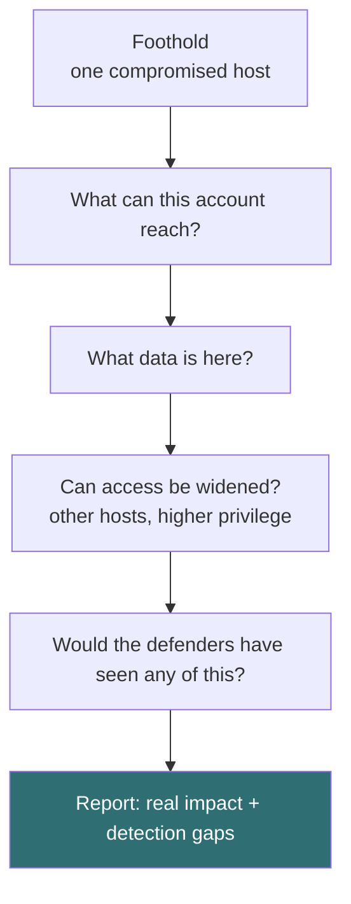

# Post-exploitation basics

Getting in is the start, not the end. Post-exploitation is about understanding
what a foothold actually means, because that is what a report has to explain: not
"I got in" but "here is what getting in lets someone do, and here is how you would
have caught it".

## The questions that matter

Once there is a foothold, the assessment is about impact and detection:

The point of each step in a legitimate test is to measure risk, not to cause
harm. You demonstrate that impact is possible; you do not maximise damage.

## Concepts you will hear

| Term | Plain meaning |
| --- | --- |
| Privilege escalation | Turning limited access into administrator access |
| Lateral movement | Using one compromised host to reach others |
| Persistence | A way back in that survives a reboot (in a test, always documented and removed) |
| Pivoting | Using a compromised host as a route into a network you could not otherwise reach |
| Exfiltration | Getting data out (in a test, proven, not actually stolen) |

## The tester's discipline

What separates an ethical test from an intrusion is discipline:

- **Stay in scope.** A foothold does not authorise following the network
  wherever it leads.
- **Do no harm.** Demonstrate impact with the lightest possible touch. You do
  not need to encrypt the files to prove you could reach them.
- **Document everything**, including any change you make, so it can be undone and
  so the client can reproduce it.
- **Clean up.** Remove any persistence, accounts, or tools you introduced. Leave
  the environment as you found it.
- **Protect what you find.** Data you access during a test is the client's,
  handled under the engagement's rules, never retained.

## The defensive half

Post-exploitation is where detection should kick in, and where it usually does
not. The defensive lessons this phase teaches:

- **Assume breach.** Design so that one compromised host is contained, not a
  skeleton key.
- **Least privilege everywhere.** The narrower each account and service, the
  less a foothold is worth.
- **Segment.** Lateral movement and pivoting are only possible across a flat
  network.
- **Log and watch the inside.** The techniques here are detectable; most
  organisations simply are not looking. The most valuable finding in many
  reports is not the way in, it is that nothing noticed.
